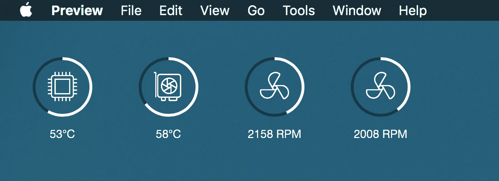

iStats Widget
---

Made for [Übersicht](http://tracesof.net/uebersicht/)

Uses the [iStats Ruby Gem](https://github.com/Chris911/iStats "iStats") to obtain SMC information about your system.

## Requirements

The widget requires the installation of a Ruby Gem to work. Installation of the Gem requires
XCode Command Line Tools installed. Follow the steps to install the gem.

1. Open the Terminal.app
2. Issue the command `xcode-select --install`
3. Issue the command `sudo gem install iStats`
4. Issue the command `$(which istats)` and check for the output.
5. Done.

To see the GPU or other sensors, you <i>may</i> need to enable them in Terminal as well

1. Find the sensor(s) you wish to add with `istats scan`
2. Issue the command `istats enable 'KEY'` 'KEY' being the ID of the sensor you wish to enable. Example of my GPU 0 Die sensor key: TG0D
3. Issue the command `istats` and check if the sensor was added under the Extra Stats section.

## Appearance & Options

You can find basic options in the file `index.js` in the top section `ui`. Some tweaks will require you to make
changes in the styles in the bottom section `style` of the file.

* `unit` Temperature unit, either C or F
* `top` or `bottom` Top or Bottom position in px
* `left` or `right` Left or Right position in px
* `color` Donut chart color
* `bgcolor` Donut chart background color
* `bgopacity` Donut chart background opacity
* `width` Donut chart width in px, should be same as `height`
* `height` Donut chart height in px, should be same as `width`
* `radius` Donut chart radius in px, needs to be smaller than `width`&`height`
* `thickness` Donut chart line width in px
* `iconsize` Font size of the icons in px
* `iconheight` Line height of the icon font in px
* `fontsize` Font size of the labels in px

## Credits

Icons by [WebHostingHub](http://www.webhostinghub.com/glyphs/) & Gunnthorian
